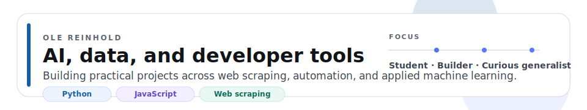
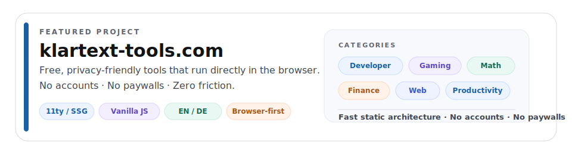
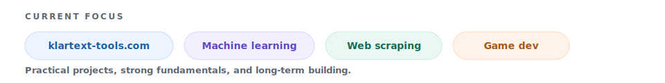

<picture>
  <source media="(prefers-color-scheme: dark)" srcset="https://readme-typing-svg.demolab.com?font=Fira+Code&size=28&duration=0&pause=0&color=C0C0C0&center=true&vCenter=true&repeat=false&width=680&lines=OLE+REINHOLD">
  
</picture>

<b>AI & DATA SCIENCE · STUDENT · DEVELOPER</b>

**Building practical tools, data-driven projects, and experiments at the intersection of code, AI, and curiosity.**

B.Sc. Artificial Intelligence & Data Science  
Baden-Württemberg, Germany

 

 

<picture>
  <source media="(prefers-color-scheme: dark)" srcset="assets/hero-banner-dark.svg">
  
</picture>

---

## About

I enjoy building things that are useful, interesting, or technically challenging — from scraping pipelines and automation tools to simulations, games, and web applications.

My current interests include:

- web scraping and data collection systems
- practical AI and machine learning
- developer-focused and utility-driven web products
- experimentation across software, data, and interactive systems

I am always learning, always building, and open to connecting with people working on similar problems.

---

## Featured Project

  <picture>
    <source media="(prefers-color-scheme: dark)" srcset="assets/project-card-dark.svg">
    
  </picture>

### Klartext Tools

Klartext Tools is a growing collection of free, privacy-friendly browser tools built to be genuinely useful. The project focuses on fast, accessible, no-account tools that solve real problems without unnecessary friction.

It currently includes tools across areas such as:

| Category | Examples |
|---|---|
| Developer Tools | JSON formatter, Regex tools, JWT decoder, Cron builder, Base64 and hashing tools |
| Gaming Tools | FPS calculator, sensitivity converters, aim visualizer |
| Math and Science | Function plotter, statistics calculator, unit converter, equation solver |
| Web Utilities | SEO meta tag generator, sitemap validator, Open Graph preview, UTM builder |
| Home and DIY | Paint, tile, flooring, and concrete calculators |
| Diagnostics | Keyboard tester, typing speed test, reaction time test |

**Tech:** Eleventy (11ty), Nunjucks, Vanilla JavaScript, multilingual architecture, static deployment

[Visit klartext-tools.com](https://klartext-tools.com/en/)

---

## Languages

`C` `Python` `Java` `JavaScript` `R` `SQL` `HTML` `LaTeX`

---

## Tools and Environments

---

## Libraries and Frameworks

---

## GitHub Activity

  <picture>
    <source media="(prefers-color-scheme: dark)" srcset="https://ghchart.rshah.org/5B7CFA/reinhole">
    
  </picture>

---

## Current Focus

  <picture>
    <source media="(prefers-color-scheme: dark)" srcset="assets/focus-bar-dark.svg">
    
  </picture>

---

## Contact

---

  Open to collaboration · Based in Germany · English and German

