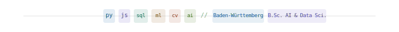
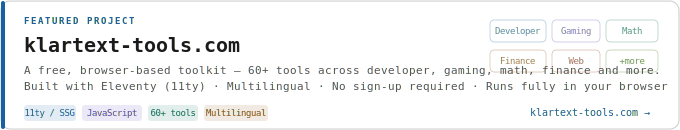
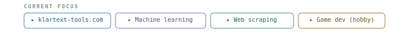

<div align="center">

<!-- HERO -->
<picture>
  <source media="(prefers-color-scheme: dark)" srcset="https://readme-typing-svg.demolab.com?font=Fira+Code&size=28&duration=0&pause=0&color=C0C0C0&center=true&vCenter=true&repeat=false&width=680&lines=OLE+REINHOLD">
  
</picture>

<sup><b>AI & DATA SCIENCE · STUDENT · HOBBYIST DEVELOPER</b></sup>

**Building things at the intersection of data, code, and curiosity.**
B.Sc. Artificial Intelligence & Data Science · Baden-Württemberg, Germany

[](https://instagram.com/ole__7.2.1.8.20.9.12.14)
[](https://www.linkedin.com/in/ole-reinhold-91a55b289)
[](mailto:sangria82artsier@icloud.com)
[](https://klartext-tools.com/en/)

<!-- SVG HERO BANNER -->


</div>

---

### ABOUT

I love building things — from data pipelines and scraping tools to games and simulations. Currently focused on **web scraping applications** and always looking to connect with others in that space. Whether it's automating the boring stuff or exploring a new framework, I'm usually tinkering with something.

> Open to collaboration · Always learning · AI-Enthusiast

---

### FEATURED PROJECT

<!-- PROJECT CARD SVG -->
<div align="center">

</div>

**What it is:** A growing collection of free, privacy-friendly online tools that run entirely in the browser — no accounts, no tracking, no paywalls.

**Tool categories:**

| Category | Highlights |
|---|---|
| Developer Tools | JSON formatter, Regex tools, JWT decoder, Cron builder, Base64/Hashing |
| Gaming Tools | FPS calculator, Sensitivity converters (CS2, VALORANT, Fortnite), Aim visualizer |
| Math & Science | Function plotter, Statistics calculator, Unit converter, Equation solver |
| Web Utilities | SEO meta tag generator, Sitemap validator, Open Graph preview, UTM builder |
| Handyman | Paint, tile, flooring & concrete calculators |
| Browser Diagnostics | Keyboard tester, Typing speed test, Reaction time test |

**Tech:** Eleventy (11ty) · Nunjucks · Vanilla JS · EN/DE multilingual · Static site, CDN-deployed

[](https://klartext-tools.com/en/)

---

### LANGUAGES

<div align="center">

[](https://skillicons.dev)

`C` `Python` `Java` `JavaScript` `R` `SQL` `HTML` `LaTeX`

</div>

---

### TOOLS & ENVIRONMENTS

<div align="center">

[](https://skillicons.dev)

</div>

---

### TECH STACK

<div align="center">


</div>

---

### CURRENT FOCUS

<!-- FOCUS BAR SVG -->
<div align="center">

</div>


---

<div align="center">
<sub>✓ Open to collaboration &nbsp;·&nbsp; ✓ Based in Germany &nbsp;·&nbsp; ✓ Speaks English & German &nbsp;·&nbsp; ✓ <a href="https://klartext-tools.com/en/">klartext-tools.com</a></sub>
</div>&nbsp;
&nbsp;
&nbsp;


[](https://klartext-tools.com/en/)

---

## Languages

<div align="center">

[](https://skillicons.dev)

</div>

---

## Environments & Tools

<div align="center">

[](https://skillicons.dev)

</div>

---

## Libraries & Frameworks

<div align="center">

&nbsp;
&nbsp;
&nbsp;


</div>

---

## Current Focus

```
  klartext-tools.com    building and expanding the tool library
  Web scraping          data collection pipelines
  Machine learning      applied AI, coursework + personal projects
  Game development      hobby — Unreal, Godot, Unity
```

---

<div align="center">

&nbsp;
&nbsp;


</div>
