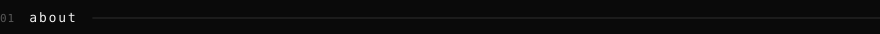
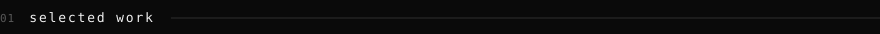
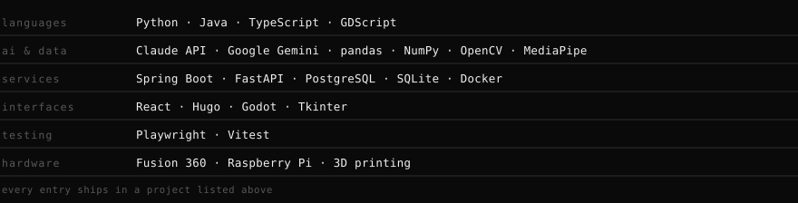
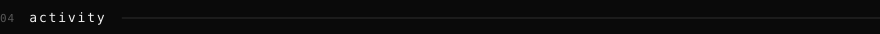
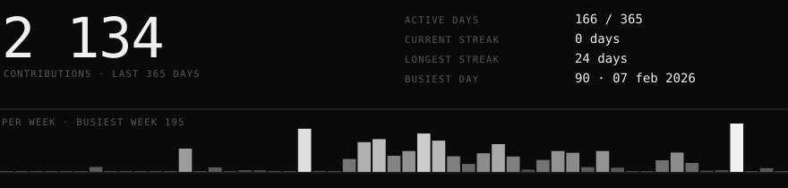
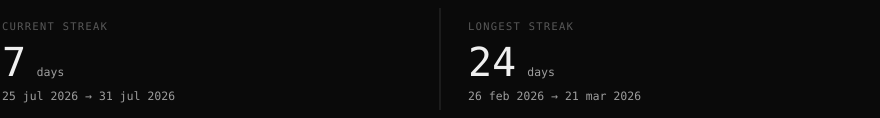
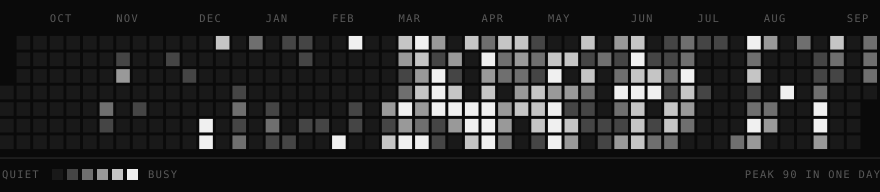
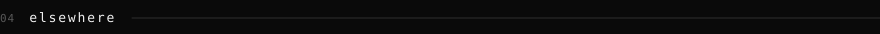
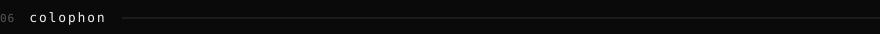

  

> I build systems where code meets messy reality: trading workflows with 
> human approval gates, student tools that replace scattered portals, web 
> utilities that earn traffic, and a flapping-wing robot that started as a 
> research pitch.

What has stayed constant since school is the pull between hardware and 
software — writing the code, then printing the part it has to run on. A CAD 
file and a 3D printer turn an idea into something that either works or 
visibly doesn't, which is a faster teacher than any tutorial.

The thread through most of my software is narrower than it looks: take 
information that is technically public but badly organised, and make it 
legible. It began as a scraper for German judicial and insolvency auctions, 
written for a course, and grew from there. That is also why markets 
interest me — start-ups, investing and M&A are where data analysis stops 
being an exercise and starts changing a decision, and where being wrong is 
expensive enough to keep you honest.

Away from the keyboard: alto saxophone in the active orchestra of the 
Musikverein Kuppingen since 2015, twelve years with the DLRG as a lifeguard 
and group leader, and these days the Fresher's Weekend for incoming computer 
science students in Stuttgart.

<samp><b>01 · risk before autonomy</b> 
In synapse, models can narrate or veto trades, but they cannot increase risk 
or execute on their own. 
 
<b>02 · software for real friction</b> 
UniVerse exists because student life is split across too many portals, 
calendars, menus, and grade systems. 
 
<b>03 · curiosity leaves artifacts</b> 
CAD iterations, scraped datasets, saxophone practice, rescue training, and 
small tools all belong to the same habit: build, test, refine.</samp>

**synapse** — <samp>LLM-gated execution architecture</samp>

A trading system designed around one constraint: AI can reduce risk, never 
silently increase it.

<samp>Python · Claude API · Google Gemini · Interactive Brokers · FastAPI</samp> 
<samp>-> <a href="https://olereinhold.com/projects/synapse/">olereinhold.com/projects/synapse</a></samp>

 

**UniVerse** — <samp>Active full-stack platform</samp>

A campus companion built to collapse the daily mess of menus, exams, grades, 
calendars, and portals.

<samp>Java · Spring Boot · React · TypeScript · Docker · PostgreSQL</samp> 
<samp>-> <a href="https://olereinhold.com/projects/universe/">olereinhold.com/projects/universe</a></samp>

 

**Klartext Ventures** — <samp>38 live tools across 15 categories</samp>

A registered business around useful web tools: find underserved searches, 
ship the cleanest answer, measure the traffic.

<samp>Hugo · Python · Playwright · Vitest · SEO</samp> 
<samp>-> <a href="https://klartext-tools.com/en/">klartext-tools.com</a> · <a href="https://olereinhold.com/projects/klartext-ventures/">olereinhold.com/projects/klartext-ventures</a></samp>

 

**MIDAS** — <samp>M&A and auction scrapers with desktop GUIs</samp>

A local intelligence workflow for finding undervalued assets across business 
acquisitions and industrial auctions.

<samp>Python · SQLite · Tkinter · pandas</samp> 
<samp>-> <a href="https://olereinhold.com/projects/midas/">olereinhold.com/projects/midas</a></samp>

 

**Hirundinidae** — <samp>Grant-funded biomimetics R&D</samp>

A flapping-wing robot where the hard part was never the electronics — it was 
making a 3D-printed wing move like a living one.

<samp>Fusion 360 · 3D printing · Raspberry Pi · Mechatronics</samp> 
<samp>-> <a href="https://olereinhold.com/projects/hirundinidae/">olereinhold.com/projects/hirundinidae</a></samp>

 

**Face Timelapse Generator** — <samp>Open-source tool, MIT</samp>

A daily self-portrait since 2024, and the alignment pipeline that turns two 
years of them into one steady video.

<samp>Python · MediaPipe · OpenCV · NumPy</samp> 
<samp>-> <a href="https://github.com/reinhole/face-timelapse-generator">github.com/reinhole/face-timelapse-generator</a></samp>

 

**Game Jam 2025** — <samp>Playable build in 72 hours</samp>

Three days, five people, one Godot project — and the discovery that in a jam, 
the clock is a game mechanic and a deadline at once.

<samp>Godot 4.5 · GDScript</samp> 
<samp>-> <a href="https://github.com/Flizzie/game-jam-2025">github.com/Flizzie/game-jam-2025</a></samp>

Most of my repositories are private, so a public-only language breakdown
would describe two of them rather than the work. The stack above is drawn from
what the projects actually ship instead.

<samp>-> <a href="https://olereinhold.com">olereinhold.com</a> · portfolio, project write-ups, CV 
-> <a href="https://linkedin.com/in/olereinhold">linkedin.com/in/olereinhold</a> 
-> <a href="mailto:sangria82artsier@icloud.com">sangria82artsier@icloud.com</a></samp>

English and German. Based in Baden-Württemberg, Germany.

Every graphic on this page is drawn by this repository and committed to it. 
There are no third-party card services, so nothing here can rate-limit, 503, 
or restyle itself without me.

<samp><b>the portrait</b> — the same portrait_ascii.txt the portfolio site prints in 
its hero, resampled from 250 columns to 90. The site can afford 250 because it 
sizes the block in cqw against a full viewport; a README is ~880px wide, where 
250 columns collapse into grey noise. It types itself once with SMIL, then 
freezes — GitHub strips scripts, but it does run SMIL. 
 
<b>the typeface</b> — Fira Code (SIL OFL), subset per role and inlined as base64. 
An SVG loaded through &lt;img&gt; cannot fetch a subresource, so an external font 
URL silently falls back to the system monospace. Four subsets cost ~15 KB; 
inlining the full face into every file would cost megabytes. 
 
<b>the panels</b> — pitch black by choice, not adaptation. Inside an &lt;img&gt;-loaded 
SVG, prefers-color-scheme resolves against the OS rather than GitHub's own 
theme toggle, so an adaptive panel would show white ink on a white page for 
anyone running OS-dark with GitHub-light. 
 
<b>the numbers</b> — refreshed daily by a scheduled action, from the GraphQL API, 
standard library only. The window is pinned to whole UTC days so unchanged data 
renders byte-identically, and the job commits only when something moved.</samp>

Source: <a href="https://github.com/reinhole/reinhole">github.com/reinhole/reinhole</a> · portrait pipeline after <a href="https://github.com/andriidrok1/andriidrok1">andriidrok1</a>
